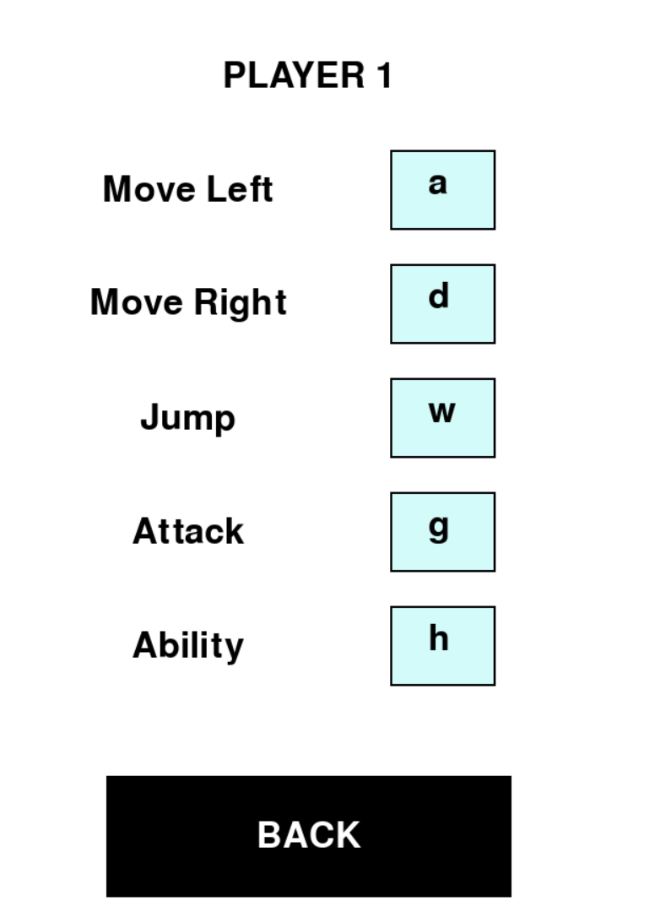
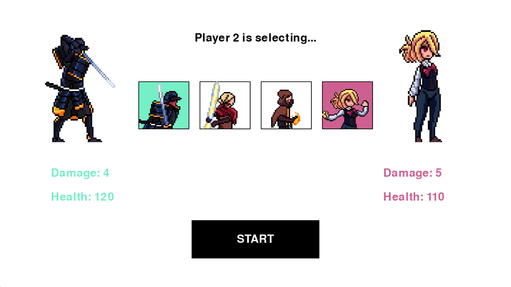
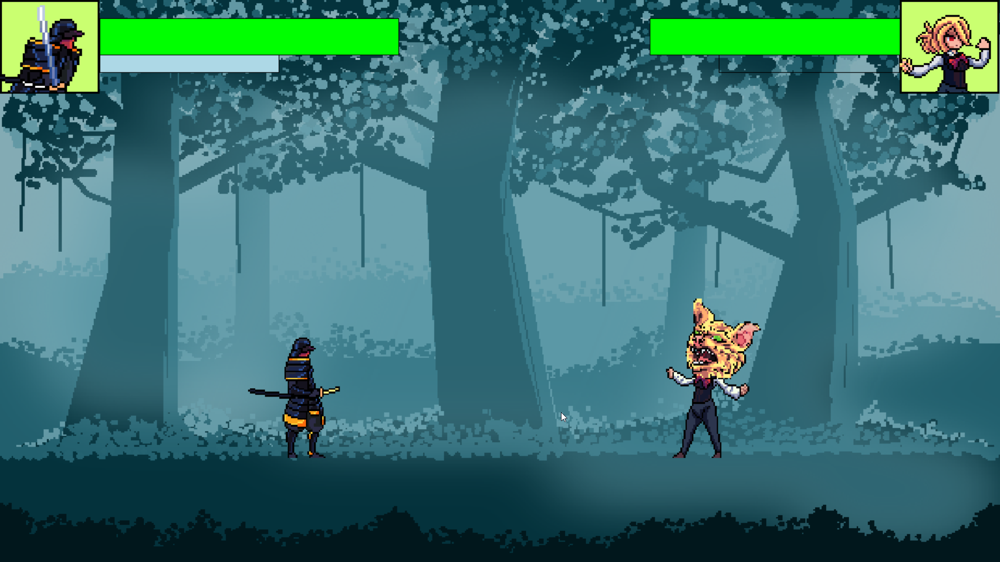

# AHIF Fighter

## Spielbeschreibung

Es können 2 Spieler jeweils einen Charakter auswählen, und dann gegeneinander kämpfen. Dabei können sie verschiedene Fähigkeiten, basierend auf den Charakter, der ausgewählt wurde, anwenden. In der folgenden Abbildung kann man sehen, wie unser Spiel aussieht.

## Tastenbelegung

Die Tasten können geändert werden. Man muss auf den blauen Rechtecken mit den Keybinds klicken und dann die gewünschte Taste drücken.

| Player 1 | Player 2    | Beschreibung       |
|----------|-------------|--------------------|
| a        | left arrow  | Nach links laufen  |
| d        | right arrow | Nach rechts laufen |
| w        | upper arrow | Springen           |
| g        | Numpad 1    | Attackieren        |
| h        | Numpad 2    | Fähigkeit benutzen |